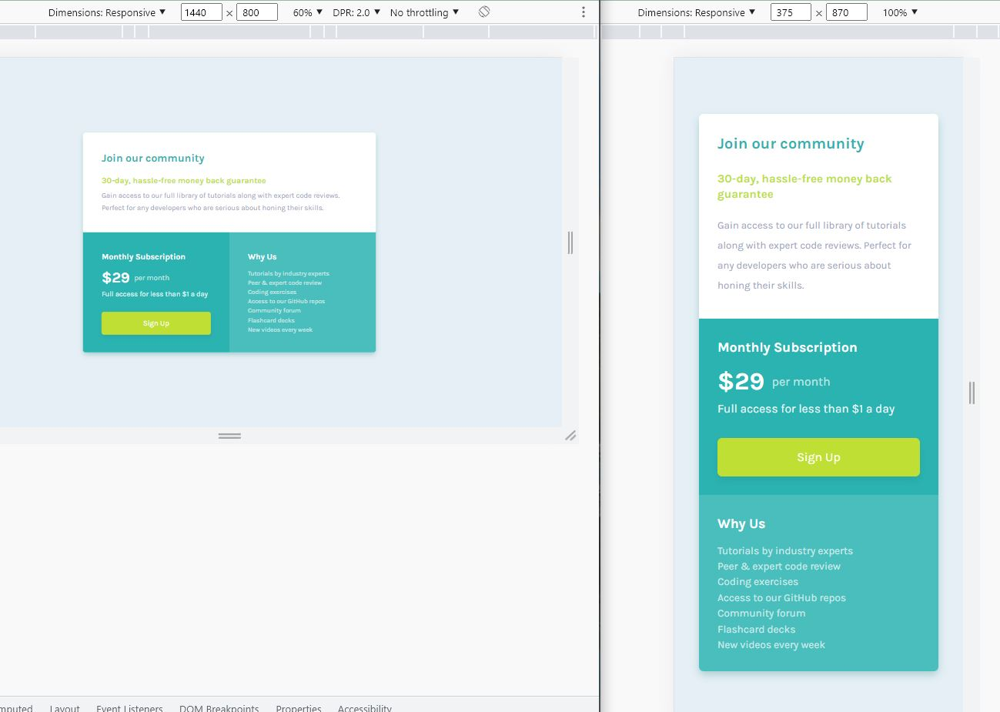

# Frontend Mentor - Single price grid component solution

This is a solution to the [Single price grid component challenge on Frontend Mentor](https://www.frontendmentor.io/challenges/single-price-grid-component-5ce41129d0ff452fec5abbbc).

## Table of contents

- [Overview](#overview)
  - [The challenge](#the-challenge)
  - [Screenshot](#screenshot)
  - [Links](#links)
- [My process](#my-process)
  - [Workflow](#workflow)
  - [Built with](#built-with)
  - [What I learned](#what-i-learned)
  - [Continued development](#continued-development)
  - [Useful resources](#useful-resources)
- [Author](#author)
- [Acknowledgments](#acknowledgments)

## Overview

### The challenge

Users should be able to:

- View the optimal layout for the component depending on their device's screen size
- See a hover state on desktop for the Sign Up call-to-action

### Screenshot

### Links

- Solution: [frontendmentor.io](https://www.frontendmentor.io/solutions/single-price-grid-component-Vsmw-cl4xx)

- Live Site: [github.io](https://siavhnz.github.io/frontendmentor/10.single-price-grid/index.html)

## My process

### Workflow

 - Setting up the workflow (Initialize Git, Setting up folders structure)
 - Setting up CSS Preflight (Adding CSS reset, Adding google fonts, Identify Css custom properties)
 - Creating HTML Skeleton based on `./assets/design` materials
 - Working on mobile design (375 x 870 {px})
 - working on desktop design (1440 x 800 {px})
 - Writting README.md
 - publish on github.io | github.com | frontendmentor.io

### Built with

- Semantic HTML5 markup
- CSS custom properties
- Mobile-first workflow
- Flexbox
- CSS Grid

### What I learned

In this challenge I learned how to style a block by `grid-area`

### Continued development

I need more practice on CSS Grid system

### Useful resources

 - [MDN Grids](https://developer.mozilla.org/en-US/docs/Learn/CSS/CSS_layout/Grids)
 
 - [CSS Grid garden game](https://cssgridgarden.com/)

## Author

- Frontend Mentor - [@siavhnz](https://www.frontendmentor.io/profile/siavhnz)

## Acknowledgments

Thanks To

[Frontendmentor.io](https://www.frontendmentor.io/challenges) - for their Excitement challenges  

[Perfect Pixel](https://chrome.google.com/webstore/detail/perfectpixel-by-welldonec/dkaagdgjmgdmbnecmcefdhjekcoceebi?hl=en) - for such a great extension

